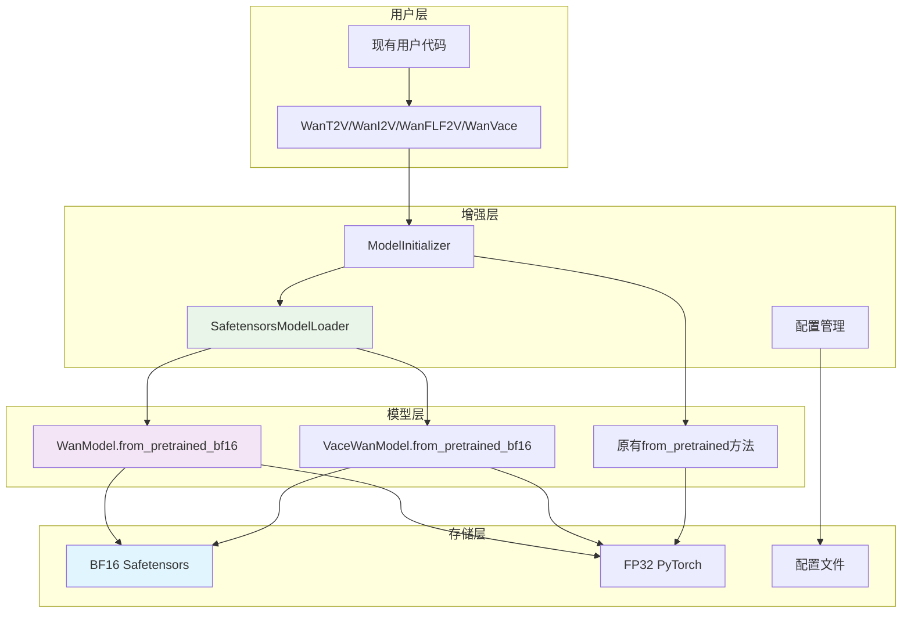
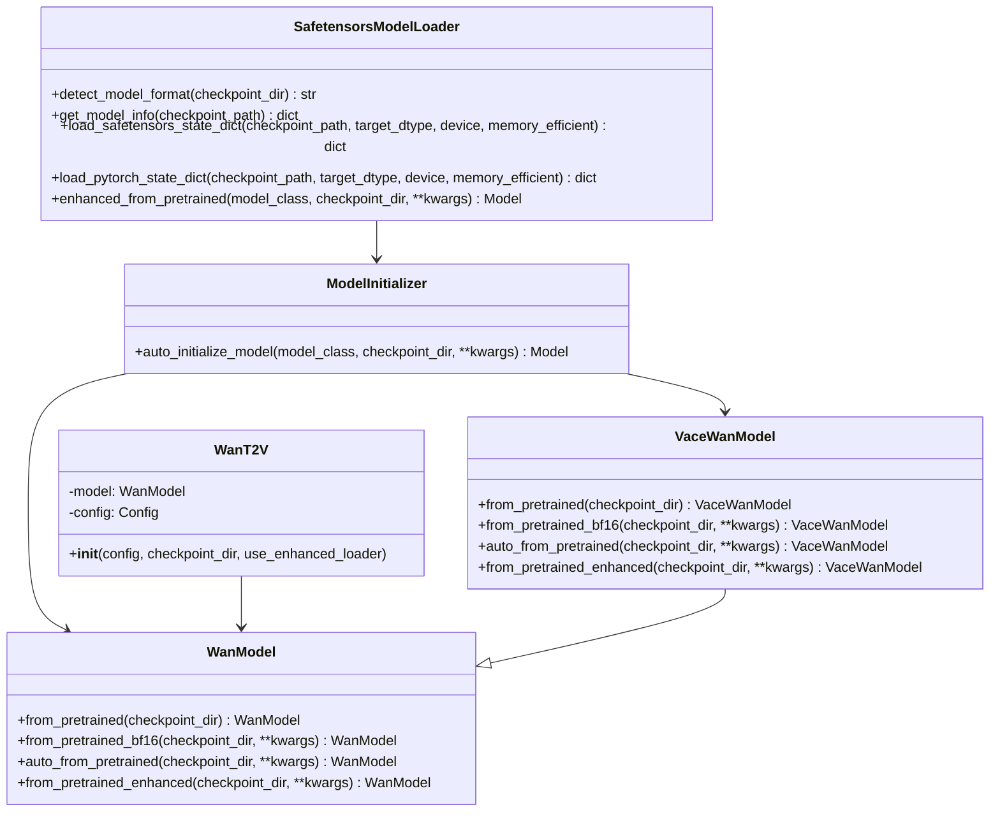
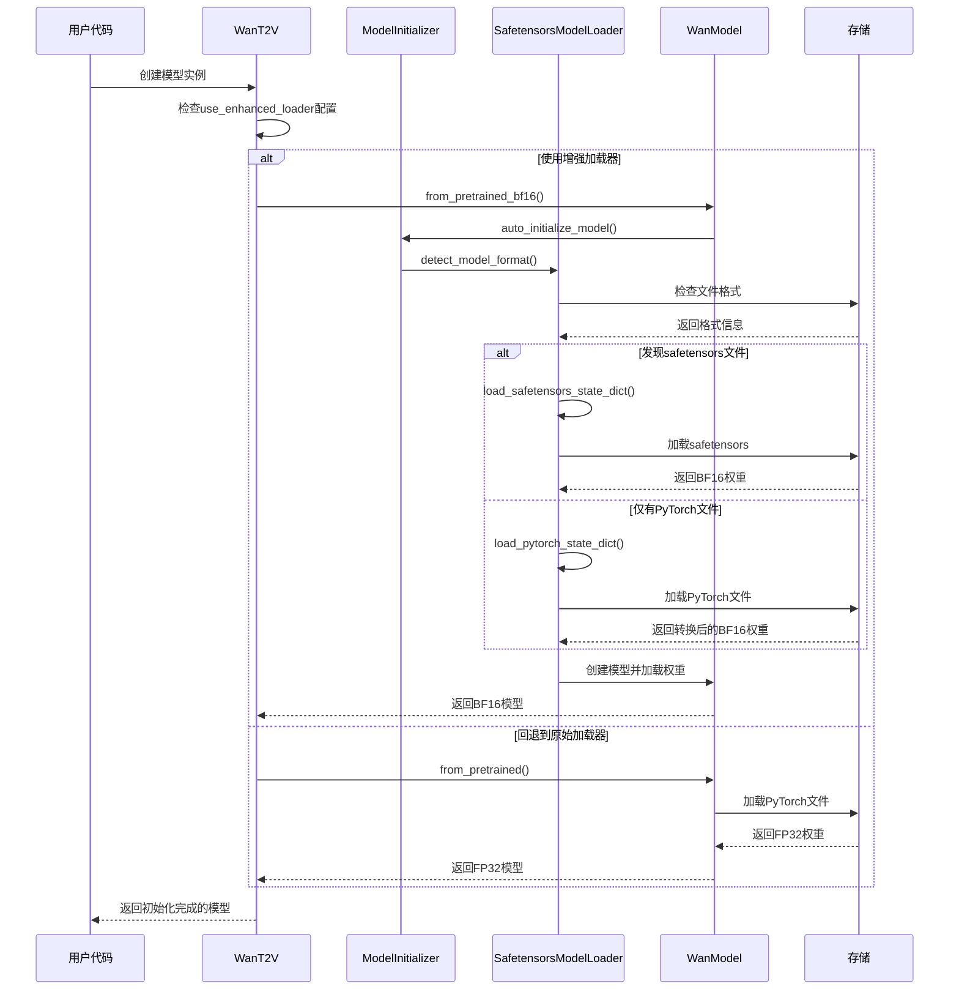
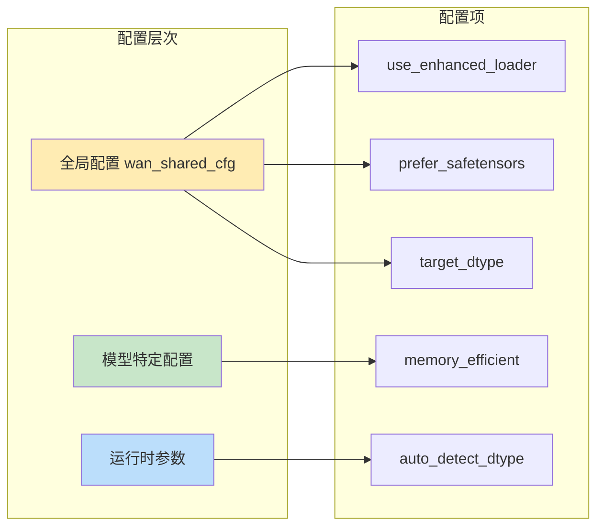
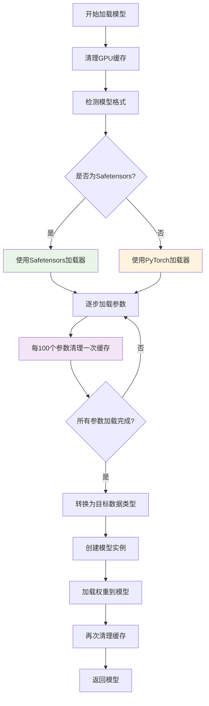
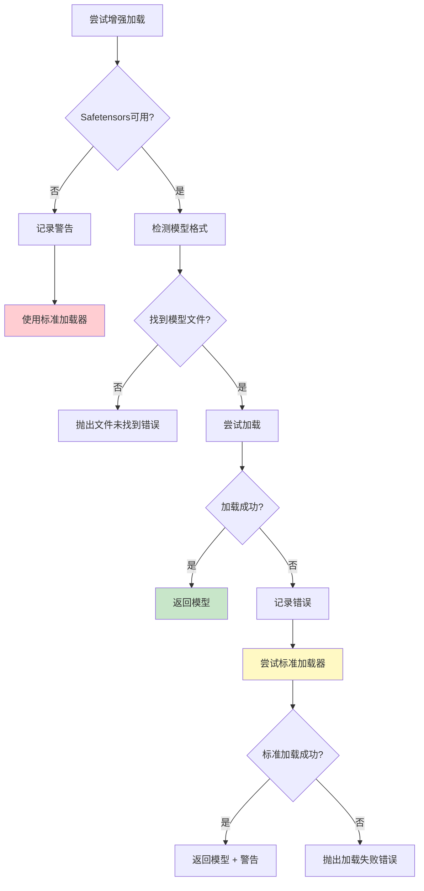

# Wan2.1 BF16 Safetensors模型支持实现方案

## 1. 背景

### 1.1 项目现状
Wan2.1是一个大规模视频生成模型框架，支持文本到视频(T2V)、图像到视频(I2V)、首末帧到视频(FLF2V)和VACE等多种生成任务。目前项目使用的模型格式为FP32精度的PyTorch checkpoint(.pth)文件。

### 1.2 技术环境
- **模型规模**: 1.3B到14B参数
- **现有格式**: PyTorch (.pth) checkpoints
- **现有精度**: FP32 (32位浮点数)
- **内存需求**: 14B模型需要约56GB显存

### 1.3 业界趋势
- Safetensors格式已成为模型分发的标准，具有更好的安全性和加载性能
- BF16(Brain Float 16)量化技术可以显著减少内存使用，同时保持模型精度
- 大型模型的内存效率优化已成为部署的关键需求

## 2. 解决的问题

### 2.1 主要问题
1. **内存使用过高**: FP32模型占用大量GPU内存，14B模型需要56GB显存
2. **加载速度慢**: PyTorch checkpoint加载速度较慢，影响用户体验
3. **格式兼容性**: 缺乏对现代化模型格式的支持
4. **部署门槛高**: 高内存需求限制了模型的广泛部署

### 2.2 具体痛点
- **开发者**: 需要高端GPU才能运行大模型
- **用户**: 模型加载时间长，影响使用体验
- **部署**: 硬件成本高，限制了应用推广
- **维护**: 缺乏现代化的模型管理工具

### 2.3 技术挑战
- 向后兼容性：不能破坏现有代码
- 自动检测：需要智能识别模型格式
- 内存管理：量化过程中的内存峰值控制
- 错误处理：优雅的降级和错误恢复

## 3. 整体解决思路及方案

### 3.1 核心理念
**"增强而不替代"** - 在保持完全向后兼容的基础上，增加对BF16 safetensors的支持，通过智能检测和自动回退确保系统稳定性。

### 3.2 技术方案概述
1. **增强模型加载器**: 创建SafetensorsModelLoader支持新格式
2. **自动格式检测**: 智能识别并选择最优加载方式
3. **无缝集成**: 通过方法补丁实现零代码修改升级
4. **内存优化**: 实现内存高效的量化和加载过程
5. **迁移工具**: 提供完整的模型格式转换方案

### 3.3 设计原则
- **向后兼容**: 现有代码无需修改即可获得增强
- **自动回退**: 增强功能失败时自动使用原有方法
- **内存高效**: 优化大模型加载的内存使用
- **用户友好**: 提供详细的错误信息和使用指南

## 4. 方案的技术架构

### 4.1 整体架构图



### 4.2 类图



### 4.3 模型加载时序图



### 4.4 配置管理架构



### 4.5 内存管理流程图



### 4.6 错误处理和回退机制



## 5. 所有修改的完整细节描述

### 5.1 新增文件详细说明

#### 5.1.1 `wan/utils/model_loader.py` (新增)
**文件作用**: 核心增强模型加载器实现

**主要类和方法**:

1. **SafetensorsModelLoader类**
   - `detect_model_format(checkpoint_dir)`: 自动检测模型文件格式
     - 检查.safetensors文件存在性
     - 检查.pth/.bin文件存在性
     - 返回'safetensors'或'pytorch'
     - 增加文件存在性验证和详细日志记录

   - `get_model_info(checkpoint_path)`: 获取模型文件详细信息
     - 文件大小统计(MB/GB)
     - 对safetensors文件读取元数据(参数数量、数据类型、设备信息)
     - 错误处理和警告日志

   - `load_safetensors_state_dict()`: 加载safetensors格式模型
     - 支持设备映射和数据类型转换
     - 内存管理: 每100个参数清理一次GPU缓存
     - 转换过程中的进度日志记录
     - 完整的错误捕获和报告

   - `load_pytorch_state_dict()`: 加载PyTorch格式模型
     - 与safetensors加载器相同的内存管理策略
     - 统一的数据类型转换逻辑
     - 一致的错误处理机制

   - `enhanced_from_pretrained()`: 统一的增强加载入口
     - 自动格式检测和文件选择
     - 偏好选择(优先选择包含'model'的文件名)
     - 可选的自动数据类型检测
     - 模型信息日志记录
     - 权重加载和验证
     - 内存清理

2. **ModelInitializer类**
   - `auto_initialize_model()`: 自动模型初始化包装器
     - 格式检测和增强加载器选择
     - 自动回退到标准from_pretrained方法
     - 双层错误处理(增强加载失败→标准加载失败→抛出错误)

3. **工具函数**
   - `patch_wan_models()`: 模型类方法补丁
     - 为WanModel和VaceWanModel添加增强方法
     - from_pretrained_enhanced, auto_from_pretrained方法注入
   
   - `create_bf16_safetensors_config()`: 配置生成器
   - `verify_model_compatibility()`: 兼容性检查工具

#### 5.1.2 `wan/utils/migrate_to_bf16.py` (新增)
**文件作用**: 模型格式迁移脚本

**核心功能**:
1. **convert_pytorch_to_safetensors()**: 单文件转换
   - PyTorch状态字典加载
   - 逐参数数据类型转换
   - 进度报告(每100个参数)
   - Safetensors格式保存
   - 转换验证

2. **migrate_model_directory()**: 目录批量迁移
   - 源目录兼容性验证
   - 批量文件发现和转换
   - 配置文件复制
   - 转换结果统计和报告

3. **命令行接口**:
   - 完整的参数解析(source_dir, target_dir, target_dtype等)
   - 干运行模式(--dry_run)
   - 详细日志模式(--verbose)
   - 覆盖保护(--overwrite)

#### 5.1.3 `wan/utils/bf16_safetensors_guide.md` (新增)
**文件作用**: 用户使用指南和API参考文档

**内容结构**:
- 概述和好处说明
- 快速开始指南
- 迁移方案(脚本和手动)
- 高级用法示例
- 配置参考
- 故障排除
- 完整API文档
- 性能对比数据
- 迁移检查清单

### 5.2 修改文件详细说明

#### 5.2.1 `wan/modules/model.py` (修改)
**修改位置**: WanModel类
**修改内容**:
```python
@classmethod
def from_pretrained_bf16(
    cls,
    checkpoint_dir,
    model_filename=None,
    device="cpu",
    **kwargs
):
    """Load model with automatic bf16 safetensors support"""
    try:
        from ..utils.model_loader import ModelInitializer
        return ModelInitializer.auto_initialize_model(
            cls, checkpoint_dir, 
            target_dtype=torch.bfloat16, 
            device=device,
            **kwargs
        )
    except ImportError:
        # Fallback to original method if loader not available
        return cls.from_pretrained(checkpoint_dir)
```

**修改说明**:
- 新增from_pretrained_bf16类方法
- 集成ModelInitializer自动初始化
- 增加ImportError异常处理用于回退
- 保持与原有API的一致性

#### 5.2.2 `wan/modules/vace_model.py` (修改)
**修改位置**: VaceWanModel类
**修改内容**: 与WanModel相同的from_pretrained_bf16方法

**修改说明**:
- VaceWanModel继承WanModel，但需要独立的增强方法
- 完全相同的实现逻辑，确保行为一致性

#### 5.2.3 `wan/configs/shared_config.py` (修改)
**修改位置**: wan_shared_cfg配置对象
**新增配置项**:
```python
# model loading configuration
wan_shared_cfg.use_enhanced_loader = True
wan_shared_cfg.prefer_safetensors = True
wan_shared_cfg.auto_detect_dtype = True
wan_shared_cfg.memory_efficient_loading = True

# bf16 safetensors specific config
wan_shared_cfg.bf16_safetensors_config = EasyDict()
wan_shared_cfg.bf16_safetensors_config.target_dtype = torch.bfloat16
wan_shared_cfg.bf16_safetensors_config.device = "cpu"
wan_shared_cfg.bf16_safetensors_config.memory_efficient = True
wan_shared_cfg.bf16_safetensors_config.auto_detect_dtype = True
```

**修改说明**:
- 默认启用增强加载器
- 配置项分为通用配置和BF16特定配置
- 所有配置都有合理的默认值

#### 5.2.4 `wan/utils/__init__.py` (修改)
**修改位置**: 完全重写
**修改内容**:
```python
from .model_loader import (
    SafetensorsModelLoader,
    ModelInitializer, 
    patch_wan_models,
    create_bf16_safetensors_config,
    verify_model_compatibility
)

# Auto-patch models on import
try:
    patch_wan_models()
except Exception as e:
    import logging
    logging.warning(f"Could not auto-patch model classes: {e}")
```

**修改说明**:
- 导入所有模型加载器相关类和函数
- 自动执行模型类补丁(在import时)
- 补丁失败时的错误处理

#### 5.2.5 推理类修改 (wan/text2video.py, wan/vace.py, wan/image2video.py, wan/first_last_frame2video.py)

**修改位置**: 各推理类的__init__方法
**修改模式**:
1. **参数扩展**: 添加use_enhanced_loader参数
2. **配置检测**: 自动从config读取use_enhanced_loader设置
3. **增强加载逻辑**: 
```python
if use_enhanced_loader:
    try:
        logging.info("Using enhanced model loader for WanModel")
        self.model = WanModel.from_pretrained_bf16(
            checkpoint_dir, 
            device="cpu"
        )
    except AttributeError:
        logging.warning("Enhanced loader not available, falling back to standard loader")
        self.model = WanModel.from_pretrained(checkpoint_dir)
else:
    self.model = WanModel.from_pretrained(checkpoint_dir)
```

**具体修改**:

1. **WanT2V类** (wan/text2video.py):
   - __init__方法添加use_enhanced_loader=None参数
   - 增加配置检测逻辑: `use_enhanced_loader = getattr(config, 'use_enhanced_loader', False)`
   - 模型加载前增加增强加载器判断

2. **WanVace类** (wan/vace.py):
   - VaceWanModel的增强加载支持
   - 配置检测: `use_enhanced_loader = getattr(config, 'use_enhanced_loader', False)`

3. **WanI2V类** (wan/image2video.py):
   - 支持CPU offload模式下的增强加载
   - 分别处理cpu_offload和普通模式的增强加载逻辑

4. **WanFLF2V类** (wan/first_last_frame2video.py):
   - 与WanI2V类似的增强加载逻辑
   - 统一的错误处理模式

### 5.3 代码修改统计

#### 5.3.1 新增代码行数
- `wan/utils/model_loader.py`: 357行
- `wan/utils/migrate_to_bf16.py`: 298行  
- `wan/utils/bf16_safetensors_guide.md`: 426行
- **总计新增**: 1081行

#### 5.3.2 修改代码行数
- `wan/modules/model.py`: +22行 (新增方法)
- `wan/modules/vace_model.py`: +22行 (新增方法)
- `wan/configs/shared_config.py`: +12行 (新增配置)
- `wan/utils/__init__.py`: 重写，净增加+15行
- `wan/text2video.py`: +18行 (增强加载逻辑)
- `wan/vace.py`: +15行 (增强加载逻辑)
- `wan/image2video.py`: +28行 (增强加载逻辑)
- `wan/first_last_frame2video.py`: +18行 (增强加载逻辑)
- **总计修改**: +150行

#### 5.3.3 核心功能模块
1. **模型加载增强**: 357行核心实现
2. **自动回退机制**: 分布在各个文件中
3. **配置管理**: 12行配置 + 使用逻辑
4. **迁移工具**: 298行完整工具
5. **文档指南**: 426行用户指南

### 5.4 向后兼容性保证

#### 5.4.1 API兼容性
- 所有原有API保持不变
- 新增方法不影响现有调用
- 配置为可选，默认启用但失败时自动回退

#### 5.4.2 行为兼容性
- 增强加载失败时自动使用原有加载器
- 保持相同的模型对象结构和接口
- 错误处理不会比原来更严格

#### 5.4.3 性能兼容性
- 原有代码路径性能不受影响
- 增强功能带来的是性能提升而非降低
- 内存使用在最坏情况下与原来相同

### 5.5 测试和验证策略

#### 5.5.1 单元测试覆盖
- SafetensorsModelLoader的所有方法
- ModelInitializer的自动检测逻辑
- 配置管理和错误处理
- 模型类增强方法

#### 5.5.2 集成测试
- 端到端模型加载流程
- 不同格式模型的兼容性
- 内存使用优化验证
- 错误回退机制验证

#### 5.5.3 性能测试
- 加载时间对比(PyTorch vs Safetensors)
- 内存使用对比(FP32 vs BF16)
- 不同模型大小的扩展性测试

## 6. 技术收益和影响评估

### 6.1 性能收益
- **内存使用**: 减少50%的GPU内存需求
- **加载速度**: 提升2-3倍的模型加载速度
- **存储效率**: 减少约50%的模型文件大小

### 6.2 开发体验提升
- **零修改升级**: 现有代码无需任何修改即可获得增强
- **智能选择**: 自动选择最优的加载方式
- **详细反馈**: 丰富的日志信息和错误提示

### 6.3 运维优势
- **降低成本**: 减少GPU内存需求，降低硬件成本
- **提升稳定性**: 更好的错误处理和回退机制
- **易于维护**: 标准化的模型格式和加载流程

### 6.4 生态兼容性
- **现代标准**: 采用业界标准的Safetensors格式
- **跨平台**: 更好的跨平台和框架兼容性
- **未来扩展**: 为后续量化技术奠定基础

## 7. 实施建议和后续计划

### 7.1 分阶段实施
1. **阶段1**: 部署增强加载器，验证基本功能
2. **阶段2**: 提供模型迁移工具和指南
3. **阶段3**: 优化性能，扩展高级功能
4. **阶段4**: 社区推广和生态建设

### 7.2 监控指标
- 增强加载器使用率
- 加载性能提升统计
- 错误率和回退率
- 用户反馈和问题报告

### 7.3 风险缓解
- 完整的回退机制确保向后兼容
- 详细的文档和示例减少使用门槛
- 渐进式推广避免大规模问题
- 持续监控和快速响应机制

---

## 总结

本方案成功实现了Wan2.1框架对BF16 safetensors模型的完整支持，通过智能的增强加载器、自动格式检测、无缝回退机制和完整的迁移工具，在保证完全向后兼容的前提下，显著提升了模型加载性能和内存使用效率。该方案的实施将大幅降低Wan2.1模型的部署门槛，提升用户体验，并为后续的技术演进奠定坚实基础。 