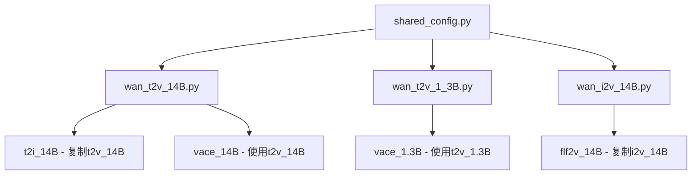

# Wan2.1 配置系统文档

## 概述

Wan2.1 使用基于 `EasyDict` 的配置系统来管理不同模型的参数设置。配置系统采用继承结构设计，通过共享基础配置和特定模型配置的组合，实现了灵活且可扩展的参数管理方案。

## 配置架构

### 总体架构图

```
wan/configs/
├── shared_config.py        # 基础共享配置
├── wan_t2v_14B.py          # 文本到视频 14B 模型配置
├── wan_t2v_1_3B.py         # 文本到视频 1.3B 模型配置
├── wan_i2v_14B.py          # 图像到视频 14B 模型配置
└── __init__.py             # 配置映射和组合
```

### 配置继承关系



## 配置分类和层次

### 1. 基础配置层 (shared_config.py)

包含所有模型共享的核心参数：

```python
wan_shared_cfg = EasyDict()

# T5 文本编码器配置
wan_shared_cfg.t5_model = 'umt5_xxl'
wan_shared_cfg.t5_dtype = torch.bfloat16
wan_shared_cfg.text_len = 512

# Transformer 核心配置
wan_shared_cfg.param_dtype = torch.bfloat16

# 推理配置
wan_shared_cfg.num_train_timesteps = 1000
wan_shared_cfg.sample_fps = 16
wan_shared_cfg.sample_neg_prompt = '...'  # 默认负面提示词
```

### 2. 模型特定配置层

各个具体模型继承基础配置并添加特定参数：

- **T2V 模型**: 纯文本到视频生成
- **I2V 模型**: 图像到视频生成（增加 CLIP 配置）
- **FLF2V 模型**: 首末帧到视频生成
- **VACE 模型**: 视频编辑模型
- **T2I 模型**: 文本到图像生成

### 3. 配置映射层 (__init__.py)

定义模型名称到配置对象的映射关系，以及支持的尺寸配置。

## 使用方式

### 1. 获取配置

```python
from wan.configs import WAN_CONFIGS

# 获取特定模型配置
config = WAN_CONFIGS['t2v-14B']
config = WAN_CONFIGS['i2v-14B']
config = WAN_CONFIGS['vace-14B']
```

### 2. 模型初始化

```python
import wan

# 使用配置初始化模型
wan_model = wan.WanT2V(
    config=config,
    checkpoint_dir=checkpoint_dir,
    device_id=0,
    rank=0
)
```

### 3. 支持的模型类型

| 模型名称 | 配置键 | 功能描述 | 参数规模 |
|---------|--------|----------|----------|
| T2V | `t2v-14B`, `t2v-1.3B` | 文本到视频生成 | 14B / 1.3B |
| I2V | `i2v-14B` | 图像到视频生成 | 14B |
| T2I | `t2i-14B` | 文本到图像生成 | 14B |
| FLF2V | `flf2v-14B` | 首末帧到视频生成 | 14B |
| VACE | `vace-14B`, `vace-1.3B` | 视频编辑 | 14B / 1.3B |

## 详细参数说明

### T5 文本编码器配置

#### `t5_model`
- **类型**: `str`
- **默认值**: `'umt5_xxl'`
- **作用**: 指定使用的T5模型类型
- **可选值**: `'umt5_xxl'`
- **影响**: 决定文本编码器的架构和参数规模

#### `t5_dtype`
- **类型**: `torch.dtype`
- **默认值**: `torch.bfloat16`
- **作用**: T5模型的数据类型
- **可选值**: `torch.float16`, `torch.bfloat16`, `torch.float32`
- **影响**: 影响内存使用和计算精度，bfloat16平衡了精度和效率

#### `text_len`
- **类型**: `int`
- **默认值**: `512`
- **作用**: 文本序列的最大长度
- **使用位置**: T5EncoderModel 初始化, WanModel forward
- **影响**: 更长的文本长度支持更复杂的描述，但会增加内存使用

#### `t5_checkpoint`
- **类型**: `str`
- **示例值**: `'models_t5_umt5-xxl-enc-bf16.pth'`
- **作用**: T5模型的检查点文件路径
- **使用位置**: T5EncoderModel 加载预训练权重

#### `t5_tokenizer`
- **类型**: `str`
- **示例值**: `'google/umt5-xxl'`
- **作用**: T5分词器的路径或名称
- **使用位置**: T5EncoderModel 初始化分词器

### VAE (变分自编码器) 配置

#### `vae_checkpoint`
- **类型**: `str`
- **默认值**: `'Wan2.1_VAE.pth'`
- **作用**: VAE模型的检查点文件路径
- **使用位置**: WanVAE 初始化
- **影响**: 决定视频编码和解码的质量

#### `vae_stride`
- **类型**: `tuple[int, int, int]`
- **默认值**: `(4, 8, 8)`
- **作用**: VAE在时间、高度、宽度维度的下采样步长
- **使用位置**: 计算潜在空间尺寸、VaceVideoProcessor
- **影响**: 
  - `(4, 8, 8)` 表示时间维度4倍下采样，空间维度8倍下采样
  - 影响潜在空间的分辨率和计算效率

### Transformer 模型配置

#### `patch_size`
- **类型**: `tuple[int, int, int]`
- **默认值**: `(1, 2, 2)`
- **作用**: 3D patch的尺寸 (时间, 高度, 宽度)
- **使用位置**: WanModel patch_embedding, VaceWanModel
- **影响**: 
  - `(1, 2, 2)` 表示时间维度不分块，空间维度2×2分块
  - 影响模型对视频时空信息的处理粒度

#### `dim`
- **类型**: `int`
- **取值范围**: 
  - 1.3B模型: `1536`
  - 14B模型: `5120`
- **作用**: Transformer的隐藏维度
- **使用位置**: WanModel, 各种embedding层, attention机制
- **影响**: 
  - 更大的维度提供更强的表达能力
  - 直接影响模型参数量和计算复杂度

#### `ffn_dim`
- **类型**: `int`
- **取值范围**:
  - 1.3B模型: `8960`
  - 14B模型: `13824`
- **作用**: 前馈网络的中间维度
- **使用位置**: WanAttentionBlock中的FFN层
- **影响**: 通常是hidden_dim的2.5-3倍，影响模型的非线性表达能力

#### `freq_dim`
- **类型**: `int`
- **默认值**: `256`
- **作用**: 时间步嵌入的频率维度
- **使用位置**: 正弦时间嵌入生成
- **影响**: 影响模型对扩散时间步的编码精度

#### `num_heads`
- **类型**: `int`
- **取值范围**:
  - 1.3B模型: `12`
  - 14B模型: `40`
- **作用**: 多头注意力的头数
- **使用位置**: WanSelfAttention, WanCrossAttention
- **影响**: 
  - 更多的注意力头提供更丰富的特征交互
  - 必须整除 `dim`

#### `num_layers`
- **类型**: `int`
- **取值范围**:
  - 1.3B模型: `30`
  - 14B模型: `40`
- **作用**: Transformer层数
- **使用位置**: WanModel blocks数量
- **影响**: 
  - 更多层提供更深的特征表示
  - 直接影响模型深度和参数量

#### `window_size`
- **类型**: `tuple[int, int]`
- **默认值**: `(-1, -1)`
- **作用**: 滑动窗口注意力的窗口大小
- **使用位置**: flash_attention 中的局部注意力
- **影响**: 
  - `(-1, -1)` 表示全局注意力
  - 正值启用局部注意力，可减少计算复杂度

#### `qk_norm`
- **类型**: `bool`
- **默认值**: `True`
- **作用**: 是否对查询(Q)和键(K)进行归一化
- **使用位置**: WanSelfAttention, WanCrossAttention
- **影响**: 
  - 改善训练稳定性
  - 防止注意力权重过于集中

#### `cross_attn_norm`
- **类型**: `bool`
- **默认值**: `True`
- **作用**: 是否对交叉注意力进行归一化
- **使用位置**: WanAttentionBlock的norm3层
- **影响**: 改善文本-视频交叉注意力的稳定性

#### `eps`
- **类型**: `float`
- **默认值**: `1e-6`
- **作用**: 层归一化的数值稳定性参数
- **使用位置**: 所有归一化层
- **影响**: 防止除零错误，影响数值稳定性

### CLIP 配置 (仅I2V模型)

#### `clip_model`
- **类型**: `str`
- **示例值**: `'clip_xlm_roberta_vit_h_14'`
- **作用**: CLIP模型类型
- **使用位置**: CLIPModel 初始化
- **影响**: 决定图像特征提取的架构

#### `clip_dtype`
- **类型**: `torch.dtype`
- **示例值**: `torch.float16`
- **作用**: CLIP模型的数据类型
- **影响**: 影响CLIP模型的精度和内存使用

#### `clip_checkpoint`
- **类型**: `str`
- **示例值**: `'models_clip_open-clip-xlm-roberta-large-vit-huge-14.pth'`
- **作用**: CLIP模型检查点路径
- **使用位置**: CLIPModel 加载权重

#### `clip_tokenizer`
- **类型**: `str`
- **示例值**: `'xlm-roberta-large'`
- **作用**: CLIP分词器路径
- **使用位置**: CLIPModel 初始化

### 推理配置

#### `num_train_timesteps`
- **类型**: `int`
- **默认值**: `1000`
- **作用**: 扩散过程的总时间步数
- **使用位置**: 扩散调度器初始化
- **影响**: 
  - 影响扩散过程的精细程度
  - 更多步数通常提供更好的生成质量

#### `sample_fps`
- **类型**: `int`
- **默认值**: `16`
- **作用**: 生成视频的帧率
- **使用位置**: 视频保存, VaceVideoProcessor
- **影响**: 决定生成视频的播放速度

#### `sample_neg_prompt`
- **类型**: `str`
- **默认值**: 复杂的中文负面提示词
- **作用**: 默认的负面提示词，用于指导模型避免生成不良内容
- **使用位置**: 文本到视频生成的负面指导
- **模型特定差异**:
  - I2V: 添加 `"镜头晃动，"`
  - FLF2V: 添加 `"镜头切换，"`

#### `param_dtype`
- **类型**: `torch.dtype`
- **默认值**: `torch.bfloat16`
- **作用**: 主模型的参数数据类型
- **影响**: 平衡计算精度和内存效率

## 尺寸配置

### 支持的分辨率

```python
SIZE_CONFIGS = {
    '720*1280': (720, 1280),    # 竖屏高清
    '1280*720': (1280, 720),    # 横屏高清
    '480*832': (480, 832),      # 竖屏标清
    '832*480': (832, 480),      # 横屏标清
    '480*640': (480, 640),      # 竖屏小尺寸
    '640*480': (640, 480),      # 横屏小尺寸
    '640*848': (640, 848),      # 竖屏中等
    '848*640': (848, 640),      # 横屏中等
    '720*960': (720, 960),      # 竖屏中高
    '960*720': (960, 720),      # 横屏中高
    '1024*1024': (1024, 1024),  # 方形高清
}
```

### 各模型支持的尺寸

| 模型类型 | 支持的尺寸 |
|---------|-----------|
| T2V-14B | `720*1280`, `1280*720`, `480*832`, `832*480` |
| T2V-1.3B | `480*832`, `832*480` |
| I2V-14B | 几乎所有尺寸（除 `1024*1024`） |
| T2I-14B | 所有尺寸 |
| FLF2V-14B | `720*1280`, `1280*720`, `480*832`, `832*480` |
| VACE-14B | `720*1280`, `1280*720`, `480*832`, `832*480` |
| VACE-1.3B | `480*832`, `832*480` |

## 配置使用场景

### 1. 文本到视频生成 (T2V)

**适用场景**: 根据文本描述生成视频
**配置特点**:
- 仅使用T5文本编码器
- 支持较大的分辨率
- 推理步数通常为50步

```python
# 使用示例
config = WAN_CONFIGS['t2v-14B']
model = wan.WanT2V(config=config, ...)
video = model.generate(
    "A beautiful sunset over the ocean",
    size=(1280, 720),
    sampling_steps=50
)
```

### 2. 图像到视频生成 (I2V)

**适用场景**: 基于输入图像生成视频动画
**配置特点**:
- 额外包含CLIP配置用于图像编码
- 支持最多样的分辨率
- 推理步数通常为40步

```python
# 使用示例
config = WAN_CONFIGS['i2v-14B']
model = wan.WanI2V(config=config, ...)
video = model.generate(
    "The girl is walking",
    input_image,
    sampling_steps=40
)
```

### 3. 首末帧到视频生成 (FLF2V)

**适用场景**: 基于首帧和末帧生成中间过渡视频
**配置特点**:
- 继承I2V配置
- 特殊的负面提示词避免镜头切换
- 推理shift参数通常设为16

### 4. 视频编辑 (VACE)

**适用场景**: 对现有视频进行编辑和修改
**配置特点**:
- 复用T2V配置架构
- 使用VaceWanModel替代WanModel
- 支持mask和参考图像输入

## 模型参数对比

| 配置项 | T2V-1.3B | T2V-14B | I2V-14B |
|-------|----------|---------|---------|
| dim | 1536 | 5120 | 5120 |
| ffn_dim | 8960 | 13824 | 13824 |
| num_heads | 12 | 40 | 40 |
| num_layers | 30 | 40 | 40 |
| 总参数量 | 1.3B | 14B | 14B |
| CLIP支持 | ❌ | ❌ | ✅ |

## 最佳实践

### 1. 选择合适的模型规模

- **1.3B模型**: 适合快速原型开发和资源受限环境
- **14B模型**: 适合高质量生成需求

### 2. 内存优化配置

```python
# 启用模型卸载以节省显存
model = wan.WanT2V(
    config=config,
    t5_cpu=True,      # T5模型放在CPU
    dit_fsdp=True,    # 启用DiT模型分片
    cpu_offload=True  # 启用CPU卸载
)

# 生成时使用模型卸载
video = model.generate(
    prompt,
    offload_model=True
)
```

### 3. 分布式推理配置

```python
# 使用USP并行策略
model = wan.WanT2V(
    config=config,
    use_usp=True,
    ulysses_size=2,   # 序列并行度
    ring_size=2       # 环形注意力并行度
)
```

### 4. 推理参数调优

```python
# 针对不同任务的推理参数建议
inference_configs = {
    't2v': {
        'sampling_steps': 50,
        'shift': 5.0,
        'guide_scale': 5.0
    },
    'i2v': {
        'sampling_steps': 40,
        'shift': 3.0,  # 480p视频推荐
        'guide_scale': 5.0
    },
    'flf2v': {
        'sampling_steps': 50,
        'shift': 16.0,
        'guide_scale': 5.5
    }
}
```

## 故障排除

### 常见配置问题

1. **内存不足**: 
   - 启用 `t5_cpu=True`
   - 使用 `offload_model=True`
   - 选择较小的分辨率

2. **精度问题**:
   - 检查 `param_dtype` 和 `t5_dtype` 设置
   - 在精度要求高的场景使用 `torch.float32`

3. **兼容性问题**:
   - 确保 `dim` 能被 `num_heads` 整除
   - 验证输入尺寸在支持范围内

## 扩展配置

### 自定义配置示例

```python
from easydict import EasyDict
from wan.configs.shared_config import wan_shared_cfg

# 创建自定义配置
custom_config = EasyDict()
custom_config.update(wan_shared_cfg)

# 自定义参数
custom_config.dim = 2048
custom_config.num_heads = 16
custom_config.num_layers = 24
custom_config.sample_fps = 24  # 24fps视频

# 使用自定义配置
model = wan.WanT2V(config=custom_config, ...)
```

这个配置系统的设计使得Wan2.1能够灵活适应不同的应用场景，同时保持代码的可维护性和扩展性。通过合理配置这些参数，用户可以在生成质量、计算效率和资源使用之间找到最佳平衡点。 